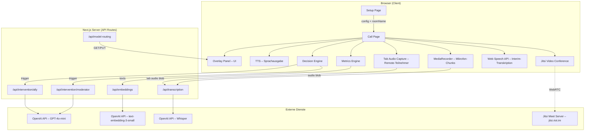
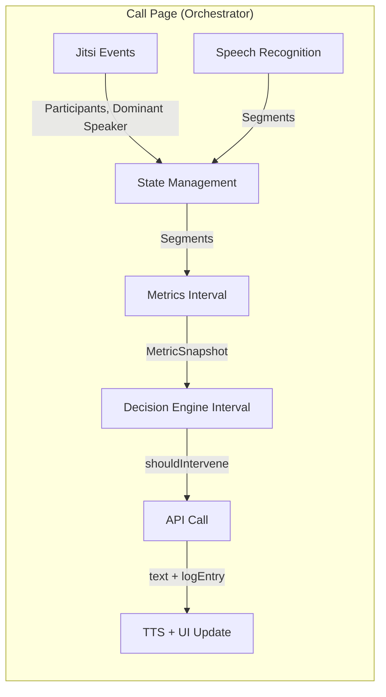
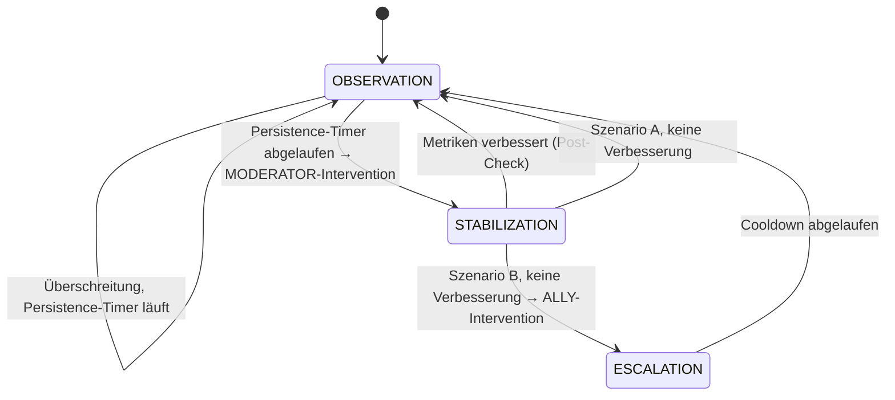
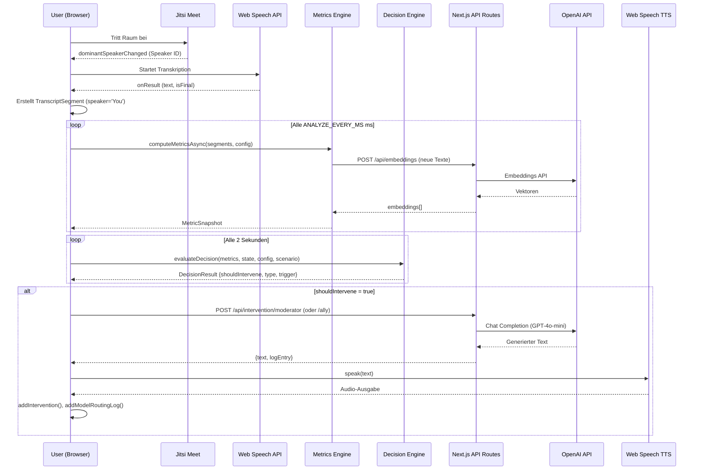

# Technische Architektur – UZH Brainstorming Webapp

## 1. Überblick

Die Applikation ist ein webbasiertes Forschungswerkzeug zur Analyse und Unterstützung von Brainstorming-Sessions mit mehreren Teilnehmenden. Sie erfasst in Echtzeit Gesprächsdaten, berechnet Metriken zu Partizipationsbalance, semantischer Repetition und inhaltlicher Diversität, und generiert bei Bedarf automatisierte KI-gestützte Interventionen in zwei Rollen: als **Moderator** (sachliches Lenken der Diskussion) oder als **Ally** (kreativer Impulsgeber).

Das System ist als Single-Page Application (SPA) mit Next.js implementiert und verbindet folgende Hauptkomponenten:



---

## 2. Technologie-Stack

| Schicht | Technologie | Version | Zweck |
|---------|------------|---------|-------|
| Framework | Next.js (App Router) | 16.1.6 | SSR, Routing, API Routes |
| UI | React | 19.2.3 | Komponentenbasierte UI |
| Sprache | TypeScript | ^5 | Typsicherheit |
| Styling | Tailwind CSS | ^4 | Utility-first CSS |
| LLM API | OpenAI API (REST) | – | GPT-4o-mini, Embeddings, Whisper |
| Videokonferenz | Jitsi Meet External API | – | WebRTC-basierte Konferenz |
| Transkription (lokal) | Web Speech API | – | Browser-native STT (Interim) |
| Transkription (server) | OpenAI Whisper | whisper-1 | Serviceseitige ASR (final) |
| Sprachausgabe | Web Speech API | – | Browser-native TTS |
| Paketmanager | npm | – | Dependency Management |

### Externe Abhängigkeiten (Runtime)
- **OpenAI API** – Textgenerierung (Interventionen), Embeddings (Semantikanalyse), **Whisper** (Audio-Transkription)
- **Jitsi Meet** (`jitsi.riot.im`) – WebRTC-Videokonferenz, kein eigener Server nötig
- **Web Speech API** – Chrome/Edge-nativ, als Interim-Transkriptionsquelle

---

## 3. Projektstruktur

```
uzh-brainstorming-webapp/
├── app/                          # Next.js App Router
│   ├── page.tsx                  # Setup-Seite (Experiment-Konfiguration)
│   ├── layout.tsx                # Root Layout mit SessionProvider
│   ├── globals.css               # Globale Styles
│   ├── call/[room]/page.tsx      # Haupt-Session-Seite (dynamische Route)
│   └── api/
│       ├── intervention/
│       │   ├── moderator/route.ts  # Moderator-Intervention (LLM)
│       │   └── ally/route.ts       # Ally-Intervention (LLM)
│       ├── embeddings/route.ts     # Batch-Embeddings-Berechnung
│       ├── transcription/route.ts  # Whisper Audio-Transkription
│       ├── model-routing/route.ts  # Runtime-Konfiguration GET/PUT
│       └── test/route.ts           # Healthcheck
├── components/                   # React-Komponenten
│   ├── JitsiEmbed.tsx            # Jitsi-Videokonferenz-Integration
│   ├── OverlayPanel.tsx          # Rechte Seitenleiste (Tabs)
│   ├── TranscriptFeed.tsx        # Live-Transkript-Anzeige
│   ├── ChatFeed.tsx              # Chat-Nachrichten
│   ├── DebugPanel.tsx            # Metriken- und State-Visualisierung
│   ├── ModelRoutingPanel.tsx     # Model-Routing-Konfiguration (UI)
│   ├── VoiceControls.tsx         # TTS-Einstellungen
│   └── ExportButton.tsx          # Session-Daten-Export (JSON)
├── lib/                          # Kernlogik
│   ├── types.ts                  # Alle TypeScript-Interfaces
│   ├── config.ts                 # Experiment-Konfiguration + Encoding
│   ├── config/
│   │   ├── modelRouting.ts       # Model-Routing-Konfiguration
│   │   └── modelRoutingPersistence.ts  # Dateisystem-Persistenz (Server-only)
│   ├── context/
│   │   └── SessionContext.tsx     # Globaler State (React Context + Reducer)
│   ├── decision/
│   │   └── decisionEngine.ts     # Zustandsmaschine für Interventionen
│   ├── metrics/
│   │   ├── computeMetrics.ts     # Metriken-Berechnung (sync + async)
│   │   └── embeddingCache.ts     # Embedding-Cache + Cosine Similarity (persistent)
│   ├── transcription/
│   │   ├── useSpeechRecognition.ts  # Web Speech API Hook (Interim)
│   │   ├── useAudioRecorder.ts     # MediaRecorder Hook (Whisper-Chunks, Mikrofon)
│   │   └── useTabAudioCapture.ts   # Tab Audio Capture (Remote-Teilnehmer)
│   ├── tts/
│   │   └── useSpeechSynthesis.ts    # TTS Hook (Sprachausgabe)
│   └── llm/
│       └── client.ts             # Unified LLM Client (Timeout, Fallbacks)
├── data/                         # Persistente Runtime-Daten (gitignored)
│   └── model-routing.json        # Gespeicherte Model-Routing-Konfiguration
└── public/                       # Statische Assets
```

---

## 4. Datenmodell

Das System operiert mit klar definierten TypeScript-Interfaces (siehe [types.ts](file:///Users/benjaminhalfar/WebstormProjects/uzh-brainstorming-webapp/lib/types.ts)):

### 4.1 TranscriptSegment
Jedes Segment repräsentiert eine erkannte Äusserung:

| Feld | Typ | Beschreibung |
|------|-----|-------------|
| `id` | `string` | Eindeutige Segment-ID |
| `speaker` | `string` | Sprechername (`"You"`, Teilnehmername, `"Simulated"`) |
| `text` | `string` | Transkribierter Text |
| `timestamp` | `number` | Unix-Timestamp in Millisekunden |
| `isFinal` | `boolean` | `false` = Interim (noch in Bearbeitung) |
| `language` | `string` | Sprachcode (z.B. `"de-CH"`, `"en-US"`) |

### 4.2 MetricSnapshot
Periodisch berechnete Metriken über ein Sliding Window:

| Metrik | Typ | Bereich | Beschreibung |
|--------|-----|---------|-------------|
| `participationImbalance` | `number` | 0–1 | Gini-basierte Verteilung, 0 = perfekt ausgeglichen |
| `semanticRepetitionRate` | `number` | 0–1 | Paarweise Cosine-Similarity (Embeddings) bzw. Jaccard |
| `stagnationDuration` | `number` | Sekunden | Zeit seit letztem **inhaltlich neuen** Beitrag (Embedding-Novelty) |
| `diversityDevelopment` | `number` | 0–1 | Inhaltliche Diversität (Embedding-Distanz) |
| `speakingTimeDistribution` | `{[speaker]: number}` | – | Sprechzeit in Sekunden (via Audio-Level) oder Zeichenanzahl (Fallback) |

### 4.3 ExperimentConfig
Vollständig parametrisierte Experiment-Konfiguration mit 11 Parametern in 4 Kategorien:

| Kategorie | Parameter | Default | Bedeutung |
|-----------|-----------|---------|-----------|
| **Fenster** | `WINDOW_SECONDS` | 180 | Sliding-Window-Grösse in Sekunden |
| | `ANALYZE_EVERY_MS` | 5000 | Berechnungsintervall |
| **Timing** | `PERSISTENCE_SECONDS` | 120 | Dauer, wie lange ein Schwellenwert überschritten sein muss |
| | `COOLDOWN_SECONDS` | 180 | Mindestzeit zwischen Interventionen |
| | `POST_CHECK_SECONDS` | 90 | Wartezeit nach Intervention für Wirksamkeitsprüfung |
| **Schwellenwerte** | `THRESHOLD_IMBALANCE` | 0.65 | Ab welcher Imbalance eine Intervention ausgelöst wird |
| | `THRESHOLD_REPETITION` | 0.75 | Ab welcher Repetitionsrate |
| | `THRESHOLD_STAGNATION_SECONDS` | 180 | Ab welcher Stagnationsdauer |
| **Sicherheit** | `TTS_RATE_LIMIT_SECONDS` | 30 | Rate-Limiting für Sprachausgabe |
| | `MAX_INTERVENTIONS_PER_10MIN` | 3 | Maximale Interventionsanzahl pro 10 Minuten |

### 4.4 SessionLog (Export)
Alle Daten einer Session werden als JSON-Datei exportiert:
```
{
  metadata: { roomName, scenario, startTime, endTime, language },
  activeConfig: ExperimentConfig,
  transcriptSegments: TranscriptSegment[],
  metricSnapshots: MetricSnapshot[],
  interventions: Intervention[],
  voiceSettings: VoiceSettings,
  modelRoutingLog: ModelRoutingLogEntry[],
  errors: [{ timestamp, message, context }]
}
```

---

## 5. Architektur-Schichten

### 5.1 Setup-Schicht (`app/page.tsx`)

Die Setup-Seite ermöglicht die Konfiguration des Experiments vor Sessionbeginn:

- **Szenario-Auswahl**: `baseline` (keine Intervention), `A` (nur Moderator), `B` (Moderator + Ally-Eskalation)
- **Sprache**: `de-CH`, `en-US`, `fr-CH` (beeinflusst Transkription, TTS, und LLM-Prompts)
- **Raumname**: Automatisch oder manuell vergeben
- **Parameter-Tuning**: Alle 11 Konfigurationsparameter mit Slidern und Inputs
- **Validierung**: Min/Max-Constraints für jeden Parameter, Echtzeit-Feedback

Die Konfiguration wird **Base64-encoded in der URL** übertragen, sodass Sessions per Link geteilt und reproduziert werden können.

### 5.2 Session-Schicht (`app/call/[room]/page.tsx`)

Die zentrale Seite orchestriert alle Echtzeit-Subsysteme:



**Zwei periodische Intervalle laufen parallel:**
1. **Metrics-Interval** (alle `ANALYZE_EVERY_MS` ms): Berechnet `computeMetricsAsync()` mit Embedding-Fallback
2. **Decision-Engine-Interval** (alle 2s): Evaluiert State Machine, löst ggf. Interventionen aus

### 5.3 Transkription (Tri-Mode)

Die Applikation unterstützt drei Transkriptionsmodi, die parallel laufen können:

#### Web Speech API (`lib/transcription/useSpeechRecognition.ts`) – Interim-Modus

React Hook basierend auf der browser-nativen `SpeechRecognition`-API:

- **Continuous Mode**: Automatischer Restart bei Browser-Timeout
- **Interim Results**: Zeigt Text **sofort während des Sprechens** (vor Finalisierung)
- **Rolle**: Dient als **Live-Preview** – der User sieht seinen Text in Echtzeit
- **Kostenlos**: Keine API-Kosten, läuft komplett im Browser
- **Quelle**: Nur lokales Mikrofon

#### OpenAI Whisper – Mikrofon (`lib/transcription/useAudioRecorder.ts`) – Server-Modus

Serverseitige Transkription des **lokalen Mikrofons** via OpenAI Whisper API:

1. **`useAudioRecorder`-Hook** zeichnet das Mikrofon-Audio via `MediaRecorder` API auf
2. Alle **5 Sekunden** wird ein Audio-Chunk (WebM/Opus-Format) erstellt
3. Der Chunk wird an **`POST /api/transcription`** gesendet → Whisper → finaler Text
4. Segmente werden als `speaker: "You"` in den State eingefügt
- **Aktivierung**: Im Model Routing Panel `Transcription` auf enabled stellen

#### Tab Audio Capture (`lib/transcription/useTabAudioCapture.ts`) – Remote-Teilnehmer

Transkription aller **Remote-Teilnehmer** durch Aufnahme des Browser-Tab-Audios:

**Wie es funktioniert:**
1. Der User klickt **"🎙 Transcribe All"** in der Header-Leiste
2. Chrome zeigt einen Dialog zum Teilen des Tab-Audios (`getDisplayMedia`)
3. Der Hook zeichnet den gesamten Audio-Output des Tabs auf (= alle Remote-Stimmen aus Jitsi)
4. Alle 5 Sekunden wird ein Audio-Chunk an Whisper geschickt
5. Der transkribierte Text wird dem **aktuell dominanten Sprecher** zugeordnet (via Jitsi `dominantSpeakerChanged`)
6. Segmente erscheinen mit dem echten Sprecher-Namen (z.B. `speaker: "Max Müller"`)

**TTS-Unterdrückung:** Wenn das System eine Intervention vorliest (TTS), wird die Tab-Audio-Aufnahme **automatisch pausiert**, damit die eigene Sprachausgabe nicht als Remote-Teilnehmer transkribiert wird.

**Vergleich der drei Modi:**

| Eigenschaft | Web Speech API | Whisper (Mikrofon) | Tab Audio Capture |
|------------|----------------|--------------------|-|
| **Quelle** | Lokales Mikrofon | Lokales Mikrofon | Tab-Audio (Remote) |
| **Sprecher-Label** | `"You"` | `"You"` | Dominanter Jitsi-Teilnehmer |
| **Latenz** | ~100ms (Echtzeit) | 2–5s (Batch) | 2–5s (Batch) |
| **Genauigkeit** | Mittel | Hoch | Hoch |
| **Kosten** | Kostenlos | $0.006/min | $0.006/min |
| **Interim-Text** | ✅ Ja | ❌ Nein | ❌ Nein |
| **Browser-Permission** | Mikrofon | Mikrofon | Tab-Sharing-Dialog |

**Warum Whisper nicht standardmässig aktiviert ist:**
- **Kosten**: $0.006/min pro Audio-Stream. Mit Tab Audio Capture: ~$0.36 für eine 30-Minuten-Session (2 Streams)
- **Datenschutz**: Audio-Daten werden an OpenAI gesendet
- **Benötigt API-Key**: `OPENAI_API_KEY` muss konfiguriert sein

**Aktivierung:**
1. `OPENAI_API_KEY` in `.env.local` setzen
2. Im Model Routing Panel (🤖 Tab): `Transcription` auf **enabled** stellen (für lokales Mikrofon)
3. Auf der Call Page: **"🎙 Transcribe All"**-Button klicken (für Remote-Teilnehmer)

### 5.4 Metriken-Berechnung (`lib/metrics/computeMetrics.ts`)

Exportiert zwei Varianten:

#### `computeMetrics()` (synchron, Fallback)
Verwendet **textbasierte** Algorithmen:
- **Participation Imbalance**: Gini-Koeffizient der Zeichenverteilung pro Sprecher
- **Semantic Repetition Rate**: Jaccard-Similarity zwischen konsekutiven Segmenten (Wort-Set-Überlappung)
- **Diversity Development**: Type-Token-Ratio (TTR) – Verhältnis einzigartiger Wörter zu Gesamtwörtern
- **Stagnation Duration**: Zeitdifferenz seit letztem finalisierten Segment

#### `computeMetricsAsync()` (asynchron, primär)
Erweitert die synchrone Variante um **OpenAI-Embeddings** und **Audio-Level-basierte Sprechzeiten**:
- **Semantic Repetition**: Durchschnittliche **Cosine Similarity** zwischen konsekutiven Embedding-Vektoren
- **Diversity Development**: 1 − durchschnittliche **paarweise Cosine Similarity** aller Segmente
- **Stagnation Duration** (semantisch): Misst nicht nur die Zeitdifferenz seit dem letzten Segment, sondern prüft via **Embedding-Novelty**, ob das neueste Segment tatsächlich inhaltlich neu ist. Ein Segment gilt als repetitiv, wenn die Cosine Similarity zum Durchschnitt der vorherigen Segmente > 0.85 ist. Der Stagnation-Timer resetet nur bei echtem neuem Inhalt
- **Participation Imbalance**: Verwendet wenn verfügbar die **echten Sprechzeiten in Sekunden** (via Jitsi Audio-Level-Events) statt des Textlänge-Proxys
- **Automatischer Fallback** auf textbasierte Berechnung, wenn Embeddings oder Audio-Level-Daten nicht verfügbar sind

### 5.5 Embedding-Cache (`lib/metrics/embeddingCache.ts`)

Client-seitiger Cache (`Map<segmentId, number[]>`) mit **localStorage-Persistenz**:

- `loadPersistedCache(sessionId)`: Lädt gespeicherte Embeddings aus `localStorage` beim Session-Start
- `persistCache(sessionId)`: Automatisches Speichern nach jedem Batch-Fetch
- `getOrFetchEmbeddings(segments)`: Prüft Cache, fetcht nur fehlende Segmente als Batch via `/api/embeddings`
- `cosineSimilarity(a, b)`: Performante Berechnung ohne externe Library
- `computeEmbeddingRepetition()`: Konsekutive Paar-Similarity
- `computeEmbeddingDiversity()`: All-Pairs Similarity → invertiert als Diversitätsmass
- `computeNoveltyScore()`: Vergleicht neuestes Segment mit Durchschnitt vorheriger (für semantische Stagnation)
- **LRU-Eviction**: Maximal 500 Einträge (~6MB), älteste werden bei Überschreitung entfernt
- **Quota-Handling**: Bei `QuotaExceededError` werden 25% der ältesten Einträge gelöscht

### 5.6 Decision Engine (`lib/decision/decisionEngine.ts`)

Implementiert eine **deterministische 3-Zustands-Zustandsmaschine**:



**Zustandsbeschreibung:**

| Zustand | Beschreibung |
|---------|-------------|
| `OBSERVATION` | Beobachtet Metriken. Bei anhaltender Schwellenwert-Überschreitung (>`PERSISTENCE_SECONDS`) → Moderator-Intervention |
| `STABILIZATION` | Wartet `POST_CHECK_SECONDS` nach Intervention, prüft dann ob sich Metriken verbessert haben |
| `ESCALATION` | Nur in Szenario B: Nach gescheiterter Moderator-Intervention → Ally-Kreativ-Impuls |

**Sicherheitsmechanismen:**
- **Cooldown** (`COOLDOWN_SECONDS`): Mindestabstand zwischen Interventionen
- **Rate Limit** (`MAX_INTERVENTIONS_PER_10MIN`): Globale Obergrenze
- **10-Minuten-Reset**: Interventionszähler wird periodisch zurückgesetzt

**Trigger-Priorisierung:** `imbalance` > `stagnation` > `repetition`

### 5.7 LLM-Integration

#### Unified LLM Client (`lib/llm/client.ts`)

Abstrahiert alle OpenAI-API-Aufrufe mit:

- **Timeout** via `AbortController` (konfigurierbar pro Task)
- **Fallback-Chain**: Bei Fehler des Primärmodells wird automatisch das nächste Fallback-Modell versucht
- **Structured Logging**: Jeder Aufruf erzeugt ein `ModelRoutingLogEntry` mit Task, Modell, Latenz, Token-Counts, Fehler, und Fallback-Status
- **Custom Error** (`LLMError`): Tragt das `logEntry` auch im Fehlerfall für Client-seitiges Logging

#### Model Routing Config (`lib/config/modelRouting.ts`)

Zentrales Konfigurationsobjekt für 4 AI-Tasks:

| Task Key | Default Model | Temperature | Timeout | Fallback | Status |
|----------|--------------|-------------|---------|----------|--------|
| `moderator_intervention` | `gpt-4o-mini` | 0.4 | 8s | `gpt-3.5-turbo` | ✅ Aktiviert |
| `ally_intervention` | `gpt-4o-mini` | 0.9 | 10s | `gpt-3.5-turbo` | ✅ Aktiviert |
| `embeddings_similarity` | `text-embedding-3-small` | 0 | 5s | `text-embedding-ada-002` | ✅ Aktiviert |
| `transcription_server` | `whisper-1` | 0 | 15s | – | ❌ Deaktiviert |

**Runtime-Konfiguration:** Über `/api/model-routing` (GET/PUT) und das **🤖 Models** UI-Panel in der OverlayPanel-Seitenleiste können alle Parameter **ohne Neustart** geändert werden. Die Konfiguration wird automatisch in `data/model-routing.json` persistiert und überlebt **Server-Neustarts**.

#### API-Routen

**`/api/intervention/moderator` (POST):**
Generiert Moderator-Interventionen basierend auf Trigger-Typ:
- `imbalance` → Prompt fordert zum Rebalancing auf, nennt dominanten Sprecher
- `repetition` → Prompt schlägt neue Perspektiven vor
- `stagnation` → Prompt regt neue Themenaspekte an
- Sprache wird via `language`-Parameter gesteuert (Deutsch/Englisch/Französisch)

**`/api/intervention/ally` (POST):**
Generiert kreative Impulse mit höherer Temperature (0.9):
- Persona: Kreativer Brainstorming-Partner (nicht Moderator)
- Erhält Kontext der bisherigen Interventionen um Wiederholungen zu vermeiden
- Kürzere, provokantere Beiträge als der Moderator

**`/api/embeddings` (POST):**
Batch-Berechnung von Text-Embeddings:
- Input: `{ texts: string[] }` (max 50 pro Request)
- Output: `{ embeddings: number[][], count, logEntry }`
- Verwendet `text-embedding-3-small` (1536 Dimensionen)

**`/api/transcription` (POST):**
Whisper-basierte Audio-Transkription:
- Input: `FormData` mit `audio` (WebM/Opus Blob, max 25MB) und `language`
- Output: `{ text, segments: [{start, end, text}], duration, logEntry }`
- Verwendet `whisper-1` mit `verbose_json` für Segment-Timestamps
- Respektiert Timeout und Enabled-State aus Model Routing Config

### 5.8 Speaker Diarization & Multi-Speaker-Transkription

**Dreistufige Lösung für Speaker-Attribution:**

1. **`dominantSpeakerChanged`-Event**: Identifiziert welcher Teilnehmer gerade am meisten spricht

2. **`audioLevelChanged`-Event**: Präzise Sprechzeitverteilung pro Teilnehmer in Sekunden (Threshold: Audio-Level > 0.05)

3. **Tab Audio Capture + Whisper**: Transkribiert den Tab-Audio-Output (Remote-Stimmen) und ordnet den Text dem aktuell dominanten Sprecher zu

**Ergebnis:** Alle Teilnehmer werden **wörtlich transkribiert** und mit echtem Namen getaggt:
- Lokale Transkription → `"You"` (Web Speech API + Whisper Mikrofon)
- Remote-Teilnehmer → Jitsi Display Name (Tab Audio Capture + Whisper)

**Einschränkungen der Speaker-Zuordnung:**
- Bei **gleichzeitigem Sprechen** mehrerer Remote-Teilnehmer wird der gesamte Text dem dominanten Sprecher zugeordnet
- Die Zuordnung erfolgt zum Zeitpunkt der **Chunk-Grenze** (alle 5s), nicht pro Wort
- TTS-Unterdrückung verhindert, dass eigene Interventions-Sprachausgabe als Remote-Text transkribiert wird

### 5.9 Text-to-Speech (`lib/tts/useSpeechSynthesis.ts`)

React Hook für die Sprachausgabe der Interventionen:

- **Stimmenauswahl**: Filtert nach passender Sprache, bevorzugt lokal installierte Stimmen
- **Rate, Pitch, Volume**: Konfigurierbar via VoiceControls-Panel
- **Rate Limiting**: `TTS_RATE_LIMIT_SECONDS` verhindert zu häufige Sprachausgaben
- **Test-Funktion**: Ermöglicht Vorhören der konfigurierten Stimme

### 5.10 State Management (`lib/context/SessionContext.tsx`)

React Context mit Reducer-Pattern für den globalen Session-State:

- **13 Actions**: `START_SESSION`, `END_SESSION`, `ADD_TRANSCRIPT_SEGMENT`, `ADD_METRIC_SNAPSHOT`, `ADD_INTERVENTION`, `UPDATE_DECISION_STATE`, `UPDATE_VOICE_SETTINGS`, `ADD_ERROR`, `UPDATE_CONFIG`, `ADD_MODEL_ROUTING_LOG`
- **Export**: `exportSessionLog()` serialisiert den gesamten State als `SessionLog`-JSON
- **Immutability**: Alle Reducer-Updates erzeugen neue State-Objekte

---

## 6. Benutzeroberfläche

### 6.1 Layout

Zwei-Spalten-Layout auf der Call Page:
- **Links (65-70%):** Jitsi-Videokonferenz (iframe oder External API)
- **Rechts (30-35%):** OverlayPanel mit 5 Tabs

### 6.2 Overlay Panel Tabs

| Tab | Komponente | Funktion |
|-----|-----------|----------|
| 💬 Chat | `ChatFeed.tsx` | Zeigt Interventions-Nachrichten + Simulations-Input |
| 📝 Transcript | `TranscriptFeed.tsx` | Live-Transkript mit Sprecher-Labels, Interim-Text |
| ⚙️ Settings | `VoiceControls.tsx` | TTS-Konfiguration (Stimme, Rate, Pitch, Volume) |
| 🤖 Models | `ModelRoutingPanel.tsx` | Model-Routing pro Task (Dropdown, Slider, Toggle) |
| 🔧 Debug | `DebugPanel.tsx` | Echtzeit-Metriken, Decision-Engine-State, Config-Ansicht |

### 6.3 Datenexport

Die `ExportButton`-Komponente generiert eine vollständige JSON-Datei mit allen Sessiondaten. Der Dateiname enthält Raumnamen, Szenario und Timestamp.

---

## 7. Datenfluss (Ende-zu-Ende)



---

## 8. Sicherheits- und Fehlermechanismen

| Mechanismus | Implementierung |
|------------|----------------|
| API-Key-Schutz | `OPENAI_API_KEY` nur serverseitig via `process.env`, nie im Client |
| Interventions-Rate-Limit | Max `MAX_INTERVENTIONS_PER_10MIN` (Default: 3), Cooldown-Timer |
| TTS-Rate-Limit | `TTS_RATE_LIMIT_SECONDS` (Default: 30) verhindert Spam |
| LLM-Timeout | `AbortController` pro Task, konfigurierbar (Default: 8-15s) |
| LLM-Fallback | Automatische Fallback-Chain (z.B. `gpt-4o-mini` → `gpt-3.5-turbo`) |
| Embeddings-Fallback | Bei API-Fehler → Jaccard-basierte Metriken |
| Transkriptions-Recovery | Auto-Restart Web Speech API nach Browser-Timeout (300ms Delay) |
| Fehler-Logging | Alle Fehler in `SessionState.errors` mit Timestamp + Kontext |
| Graceful Degradation | Kein `OPENAI_API_KEY` → Fallback-Antwort statt Crash |
| Config-Persistenz | Model Routing Config wird in `data/model-routing.json` gespeichert |
| Cache-Persistenz | Embedding-Cache in `localStorage` mit LRU-Eviction (max 500 Einträge) |

---

## 9. Aktuelle Limitationen und offene Punkte

### 9.1 Behobene Limitationen (im Vergleich zum MVP)

| Limitation (vorher) | Lösung |
|--------|--------|
| Embeddings-Cache geht bei Page Refresh verloren | **Persistent via `localStorage`** mit LRU-Eviction (max 500 Einträge) |
| Model Routing Config nur in-memory | **Persistent via `data/model-routing.json`**, überlebt Server-Neustarts |
| `stagnationDuration` misst nur Zeitdifferenz | **Semantische Stagnation** via Embedding-Novelty (Cosine Similarity > 0.85 = repetitiv) |
| Keine serverseitige Transkription | **Whisper API Route** implementiert (`/api/transcription`) |
| Speaker Diarization nur `dominantSpeakerChanged` | **Zusätzlich `audioLevelChanged`** für akkurate Sprechzeitverteilung in Sekunden |
| Sprechzeit nur via Zeichenanzahl | **Audio-Level-basierte Messung** mit Threshold-Detection (>0.05) |
| Keine Transkription von Remote-Teilnehmern | **Tab Audio Capture** via `getDisplayMedia` + Whisper + Speaker-Zuordnung via `dominantSpeakerChanged` |

### 9.2 Verbleibende Limitationen

| Feature | Limitation |
|---------|-----------|
| **Speaker-Zuordnung** | Bei gleichzeitigem Sprechen mehrerer Remote-Teilnehmer wird Text dem dominanten Sprecher zugeordnet |
| **Whisper Kosten** | ~$0.006/min pro Audio-Stream. Daher standardmässig deaktiviert |
| **Tab Audio Capture** | Erfordert Chrome/Edge und einmalige User-Bestätigung („Tab teilen“-Dialog) |
| **Persistente Datenspeicherung** | Kein Backend-Datenbank – alle Daten leben im Browser-State und werden bei Session-Ende als JSON exportiert |
| **Authentifizierung** | Kein Login/Auth – Zugang über URL mit Raumnamen |
| **Deployment-Automatisierung** | Kein CI/CD konfiguriert |
| **Langzeit-Analytics** | Keine Aggregation über mehrere Sessions hinweg |


